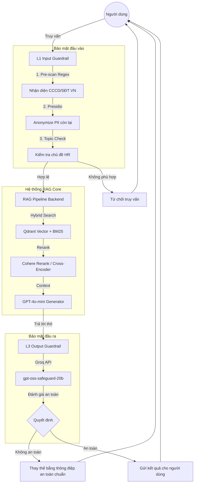

# Deployment Blueprint: Hệ Thống Production RAG Với Guardrails Stack

## Mạc Phạm Thiên Long - 2A202600384  

12 tháng 05, 2026  

Tài liệu này mô tả kiến trúc kỹ thuật, các chỉ số đảm bảo dịch vụ (SLO), ước tính chi phí vận hành và chiến lược cảnh báo cho hệ thống Production RAG, đã được tăng cường lớp bảo mật đầu vào/đầu ra.

---

## 1. Architecture Diagram (Kiến Trúc Hệ Thống)

Dưới đây là sơ đồ kiến trúc tổng quát tích hợp 3 lớp: L1 Input Guard, Hybrid RAG, và L3 Output Guard.

---

## 2. SLO Definition (Định nghĩa Mục Tiêu Chất Lượng Dịch Vụ)

Dựa trên kết quả đo lường thực tế tại Phase C, các chỉ số SLO cam kết như sau:

| Chỉ số | Mục tiêu (Target) | Ý nghĩa & Phương pháp đo lường |
|---|---|---|
| **End-to-End P95 Latency** | < 3.0 giây | Tổng thời gian xử lý từ lúc nhận Input đến lúc xuất Output cho 95% số yêu cầu. |
| **L1 Guard Overhead** | < 50 mili-giây | Thời gian trễ trung bình do lớp xử lý Regex và Presidio gây ra (thực tế đo được khoảng 12ms). |
| **L3 Guard Latency** | < 500 mili-giây | Thời gian kiểm duyệt đầu ra qua Groq API (không tính lần đầu tiên tải mô hình). |
| **PII Recall** | > 98% | Tỷ lệ nhận diện và ẩn danh thành công các thông tin CCCD và Số điện thoại Việt Nam. |
| **Topic Accuracy** | > 90% | Độ chính xác trong việc lọc bỏ các câu hỏi nằm ngoài phạm vi tài liệu nội bộ. |

---

## 3. Cost Analysis (Phân Tích Chi Phí)

Dự toán chi phí ước tính hàng tháng dựa trên lưu lượng 10,000 truy vấn/tháng:

1. **LLM Generation (OpenAI GPT-4o-mini):**
   - Input trung bình: 1000 tokens/truy vấn. Output: 200 tokens/truy vấn.
   - Chi phí: ~2.50 USD/1 triệu tokens input + ~15.00 USD/1 triệu tokens output.
   - Ước tính: **~3.50 USD / tháng**.

2. **Cross-Encoder Rerank (Cohere):**
   - Cohere cung cấp gói miễn phí cho môi trường thử nghiệm, gói Production tính theo đơn vị tìm kiếm.
   - Ước tính: **~1.00 USD / tháng** hoặc miễn phí (Free-tier).

3. **Guardrails Stack (Groq / Presidio):**
   - L1 chạy cục bộ trên CPU: Chi phí hạ tầng nền (Compute cost).
   - L3 gọi API Groq (`gpt-oss-safeguard-20b`): Hiện miễn phí cho giới hạn Rate Limit. Trong tương lai nếu tính phí có thể tương đương Llama 3, ước tính tối đa **~2.00 USD / tháng**.

**Tổng cộng:** Chi phí vận hành biến đổi rất thấp, chỉ khoảng **5.00 - 10.00 USD / tháng** cho quy mô nhỏ.

---

## 4. Alerting Strategy (Chiến Lược Cảnh Báo)

Hệ thống cần thiết lập cảnh báo tự động khi phát hiện các dấu hiệu bất thường thông qua Dashboard giám sát:

- **Critical Latency Alert:** Kích hoạt khi tổng thời gian xử lý (Latency) vượt quá 5.0 giây liên tục trong 3 yêu cầu gần nhất (Dấu hiệu nghẽn API OpenAI/Groq).
- **High Rejection Rate:** Kích hoạt khi tỷ lệ L1 Guard chặn câu hỏi vượt quá 30% trong vòng 10 phút (Có dấu hiệu tấn công Spam hoặc lỗi cấu hình Topic Validator).
- **Safety Violation Alert:** Ghi log khẩn cấp khi L3 Guard phát hiện và chặn nội dung có độ nguy hại cao (như hướng dẫn bạo lực, lộ bí mật kinh doanh).
- **API Connection Failure:** Bắn thông báo tức thì khi không thể kết nối đến Groq API hoặc cơ sở dữ liệu Qdrant local báo lỗi phân mảnh.
